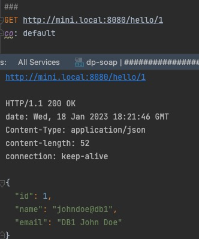
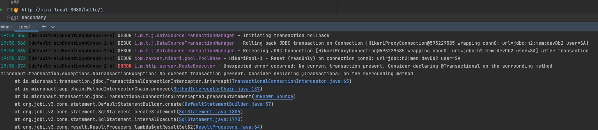

## Micronaut 3.9.0-SNAPSHOT and Micronaut Data 3.9.4

Objective: Reproduce error while selecting secondary datasource using out of box multi-tenancy.

---

## Micronaut Multi Tenancy 

Demo the error 

#### Works fine

```
GET http://mini.local:8080/hello/1
co: default
```

#### Throws  No current transaction present. Consider declaring @Transactional on the surrounding method

```
GET http://mini.local:8080/hello/1
co: secondary
```

## Feature http-client documentation

- [Micronaut HTTP Client documentation](https://docs.micronaut.io/latest/guide/index.html#httpClient)


## Feature sql-jdbi documentation

- [Micronaut Jdbi documentation](https://micronaut-projects.github.io/micronaut-sql/latest/guide/index.html#jdbi)


